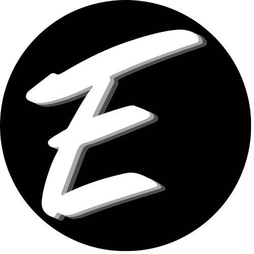

# -Next Assessnement
This is a [Next.js](https://nextjs.org) project 
assessnement 
## -Getting Started:
```bash
# Clone the repository
git clone https://github.com/usuario/proyecto.git 
# Enter the project directory
cd proyecto 
# Install dependecies
npm install 
# run the development server 
npm run dev
```

Open [http://localhost:3000](http://localhost:3000) with your browser to see the result.

## -Technologies
- **Next.js**: React framework for web applications. 
- **Material Icons**: Icon library to improve the interface. 
- **Tailwind CSS**: CSS framework for fast and modern design. 
- **TypeScript**: JavaScript superset that adds static types.
## -Are there any improvements you could make to your submission?
First, it would fill in missing functionalities, such as search, so that users can easily find the itinerary they are looking for. In addition, it would improve the itinerary leg cards, making them more visually attractive and easier to understand.
## -What would you do differently if you were allocated more time?
If I were given more time, I would optimize the way I carry out the installation of the dependencies so that this process would be faster, likewise, I would make the header of the itineraries page a reusable component just like with the table of itineraries.
## -Autor
 _Ezequiel Rogriguez **(@Mahuer2410)**_